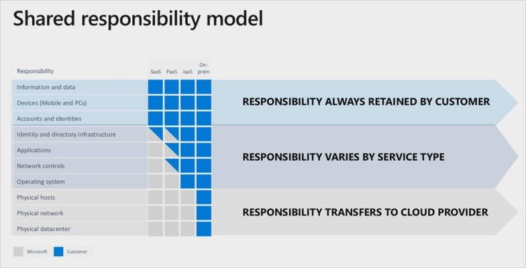

# Azure Shared Responsibility Model

<figure><figcaption>
<a href="https://community.connection.com/wp-content/uploads/2021/01/Microsoft-Azure-Shared-responsibility-model.jpg">https://community.connection.com/wp-content/uploads/2021/01/Microsoft-Azure-Shared-responsibility-model.jpg</a>
</figcaption></figure>

## Overview

The shared responsibility model in Azure is a framework that delineates the security responsibilities of Microsoft (the cloud service provider) and the customer. This division of responsibilities varies depending on the type of service deployed—Infrastructure as a Service (IaaS), Platform as a Service (PaaS), or Software as a Service (SaaS). Understanding this model is crucial for ensuring appropriate security measures are in place.

### Service Types:

#### 1. Infrastructure as a Service (IaaS)

* **Microsoft's Responsibilities**: Microsoft is responsible for securing the physical infrastructure of the data centers, including buildings, hardware, network infrastructure, and the physical hosts.
* **Customer's Responsibilities**: Customers are responsible for managing the operating system, network configuration (including firewalls), applications, and data. The security configuration of virtual machines, encryption, and access management also fall under the customer’s purview.

#### 2. Platform as a Service (PaaS)

* **Microsoft's Responsibilities**: Microsoft extends its responsibilities to include managing the operating system and physical network. They also handle all the hardware and runtime components.
* **Customer's Responsibilities**: Customers are responsible for managing the applications they deploy and the data they store. This includes ensuring that data is handled securely, applications are developed securely, and access controls are properly implemented.

#### 3. Software as a Service (SaaS)

* **Microsoft's Responsibilities**: In SaaS offerings, such as Microsoft 365, Microsoft takes on most of the security responsibilities. This includes securing the application, network controls, operating systems, and physical hosts.
* **Customer's Responsibilities**: The customer’s main responsibilities are related to access management and protecting their data. This entails managing who has access to the service and how they use it, along with securing the data as it is inputted, processed, and stored.

### Overarching Considerations

Regardless of the service model, certain aspects like client endpoints, account and access management, and data classification and accountability are generally the customer's responsibility. It's also important for customers to understand the compliance requirements specific to their industry and region, as they often need to implement additional controls to meet these requirements.
