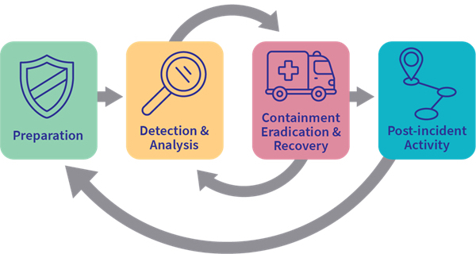

# IR Lifecycle

<figure><figcaption></figcaption></figure>

**Core IR Lifecycle**:

* **Preparation**: Develop IR policies, train teams, and configure tools.
* **Detection and Analysis**: Identify security events and understand their scope and impact.
* **Containment, Eradication, and Recovery**: Take immediate actions to stop and fix the issue.
* **Post-Incident Activities**: Document lessons learned and improve security posture.
