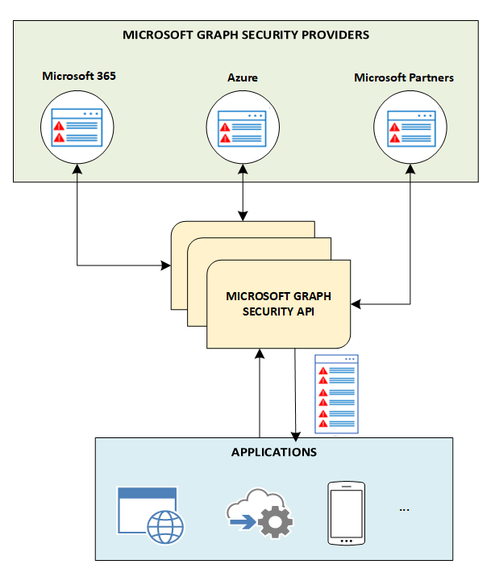

# Security API References

## Overview

The following are references to the Security API within Microsoft Graph and how it works.

### How it Works

The Microsoft Graph Security API provides a unified interface to connect various Microsoft security products, services, and partners. By acting as a central broker, it streamlines security operations and enhances capabilities for threat protection, detection, and response. When an application sends a request, the API federates it across all connected security providers, aggregates the results, and returns the data in a standardized schema. This approach simplifies the integration and management of multiple security tools through a single, programmatic interface.&#x20;

<figure><figcaption>
<a href="https://learn.microsoft.com/en-us/graph/security-concept-overview?view=graph-rest-1.0">https://learn.microsoft.com/en-us/graph/security-concept-overview?view=graph-rest-1.0</a>
</figcaption></figure>

### Security Graph Reference

The following provides a reference to the Security API of MS Graph.&#x20;



