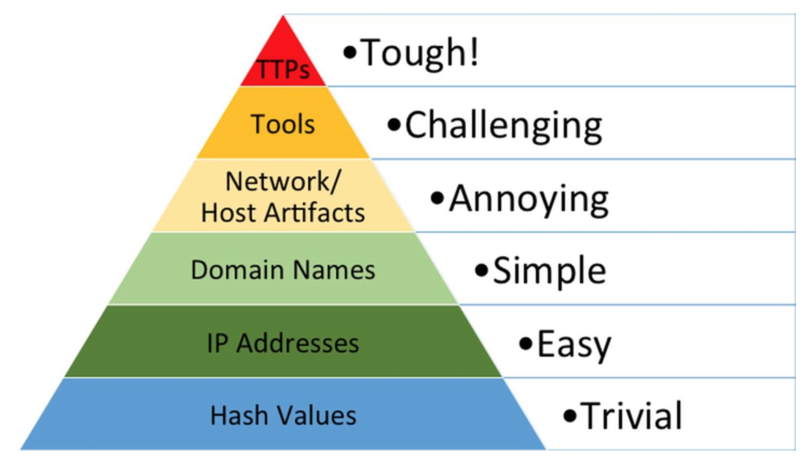

# Pyramid of Pain

<figure><figcaption>
<a href="https://phxtechsol.com/wp-content/uploads/2020/09/Screenshot-2020-09-21-at-18.10.29-scaled-1.jpg">https://phxtechsol.com/wp-content/uploads/2020/09/Screenshot-2020-09-21-at-18.10.29-scaled-1.jpg</a>
</figcaption></figure>

## Overview

The Pyramid of Pain is a framework designed to help cybersecurity professionals understand the effectiveness of different types of indicators in detecting and responding to cyber threats. Developed by David Bianco, the pyramid categorizes indicators based on how difficult they are for adversaries to change, and thus, how much "pain" they inflict on attackers when these indicators are effectively utilized by defenders. Here’s a breakdown of each level of the Pyramid of Pain:

### 1. **Hash Values**

At the base of the pyramid are hash values, which are unique identifiers generated from the contents of a file. Hash values are easy for defenders to use in identifying known malicious files. However, they are also easy for attackers to alter by making minor changes to their malware, thereby generating a new hash. This makes hash values the least painful for adversaries to overcome.

### 2. **IP Addresses**

The next level up includes IP addresses. While IP addresses can be useful in identifying the source or destination of network traffic associated with malicious activity, attackers can change these relatively easily. They might use proxy servers, VPNs, or compromised systems to alter their apparent IP address.

### 3. **Domain Names**

Domain names, used for identifying and locating computers on networks, are slightly more challenging for adversaries to change frequently. However, techniques like fast flux (rapidly changing DNS records) and domain generation algorithms (DGAs) can still allow adversaries to evade detection based on static domain lists.

### 4. **Network/Host Artifacts**

This category includes specific elements that might be left on a host or network, such as unique malware file paths, registry changes, or persistent configurations. These artifacts can provide more reliable indicators of compromise (IoCs) because they require more effort for an adversary to modify extensively across different attacks.

### 5. **Tools**

The tools that attackers use (e.g., software kits, exploit tools) are harder to replace or alter without significant cost or effort. Detecting and blocking specific tools can disrupt an attacker’s operations more substantially, as it forces them to develop or acquire new capabilities.

### 6. **Tactics, Techniques, and Procedures (TTPs)**

TTPs are the behaviors and methods used by attackers in their operations. Understanding and identifying TTPs are highly effective for defense because they are harder for adversaries to change. This level correlates with frameworks like the MITRE ATT\&CK, which documents common TTPs used by threat actors.

### 7. **Adversary Intent/Goals**

At the top of the pyramid, understanding the adversaries' overarching goals or strategic intents is the most painful for them to mitigate against. If defenders can anticipate and counter the objectives of an attack, they can implement strategic defenses that preemptively disrupt attackers' plans.

The Pyramid of Pain highlights that while basic indicators like hashes and IP addresses are useful, they often result in lower-impact defenses. As defenders move up the pyramid, the indicators become more challenging for attackers to adjust, leading to more effective and enduring security measures.
