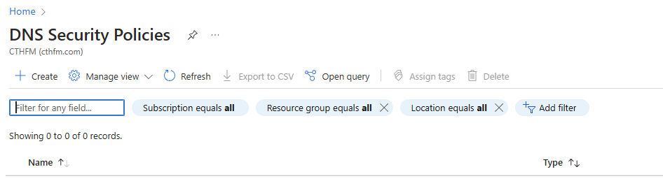

# Threat Hunting Process

## Introduction to the Threat Hunting Process

Threat hunting is a proactive and iterative security practice aimed at detecting and mitigating hidden threats. This section introduces the core stages of the threat hunting process: Hypothesis Generation, Investigation, Identification, and Resolution, emphasizing the importance of documentation and knowledge sharing.

<figure><figcaption></figcaption></figure>

## **Key Stages of the Threat Hunting Process**

1. **Hypothesis Generation**: Develop potential threat scenarios based on intelligence and historical data.
2. **Investigation**: Analyze data to validate or dismiss hypotheses using various tools and techniques.
3. **Identification**: Confirm threats by distinguishing actual dangers from false positives.
4. **Resolution**: Neutralize threats through isolation, remediation, and patching, followed by a post-hunt analysis to refine future hunts.

## **Iterative Nature of Threat Hunting**

Threat hunting is a cyclical process that evolves with each iteration, enhancing organizational security through continuous learning and adaptation.

## **Importance of Documentation and Knowledge Sharing**

Effective threat hunting relies on thorough documentation and the sharing of findings, which helps refine methods and strengthen security defenses.
