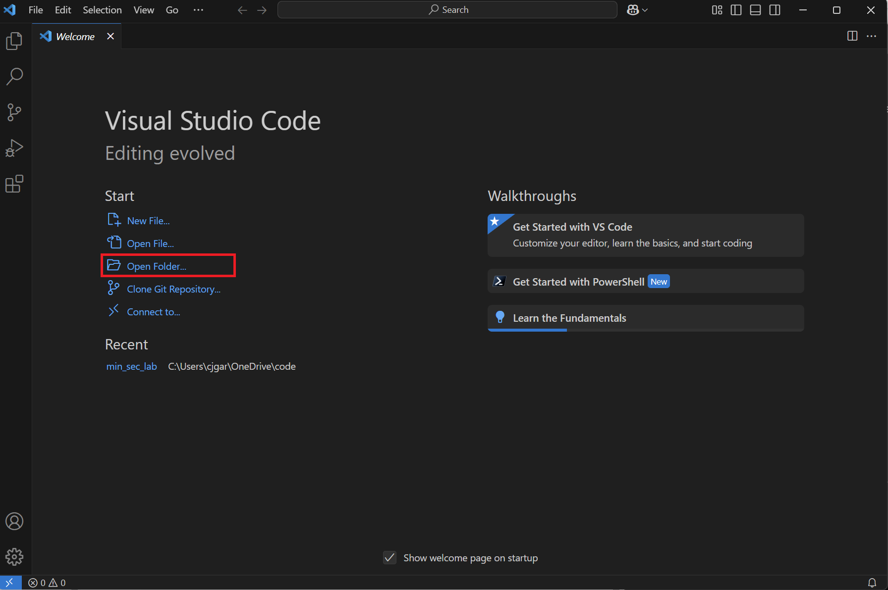

# VSCode and Code Setup

### 1. Create a Code Directory in PS

```powershell
PS C:\Users\cthfm> mkdir code

    Directory: C:\Users\cthfm


Mode                 LastWriteTime         Length Name
----                 -------------         ------ ----
d-----          3/3/2025  10:12 PM                code


PS C:\Users\cthfm>
```

### 2. Change Directories and Git Clone the Repository

```
PS C:\Users\cthfm> cd code
PS C:\Users\cthfm\code> git clone https://github.com/Cthfm/azure-detection-lab.git
Cloning into 'azure-detection-lab'...
remote: Enumerating objects: 50, done.
remote: Counting objects: 100% (50/50), done.
remote: Compressing objects: 100% (44/44), done.
remote: Total 50 (delta 13), reused 26 (delta 5), pack-reused 0 (from 0)
Receiving objects: 100% (50/50), 29.65 KiB | 138.00 KiB/s, done.
Resolving deltas: 100% (13/13), done.
PS C:\Users\cthfm\code>
```

### 3. Open VSCode

```powershell
PS C:\Users\cthfm\code> code
```

### 4. Open Folder

<figure><figcaption></figcaption></figure>

### 5. Select the 'Code' Folder

<figure><figcaption></figcaption></figure>


### 6. Select the folder

<figure><figcaption></figcaption></figure>


### 7. Accept the code from the author.

<figure><figcaption></figcaption></figure>
